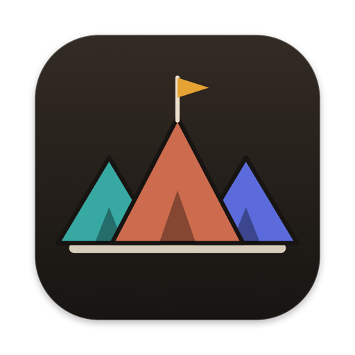
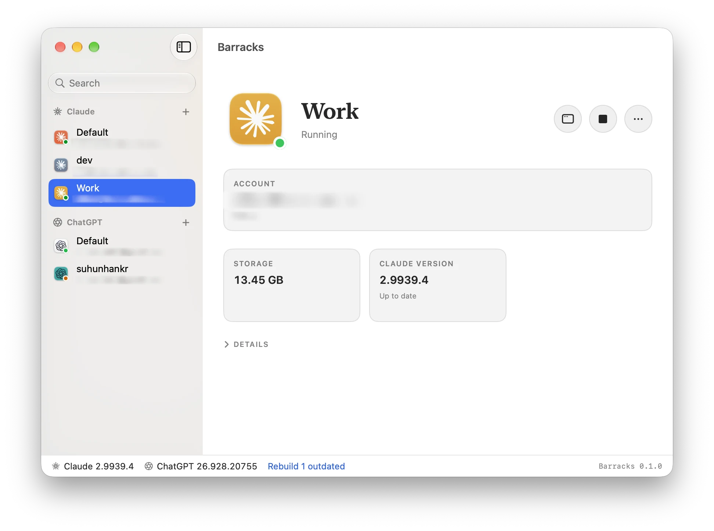

<div align="center">
  
  <h1>Barracks</h1>
  <p>Run multiple Claude &amp; ChatGPT apps side by side on your Mac.</p>
  <p>
    <a href="https://github.com/ssut/Barracks/releases"></a>
    
    
    <a href="LICENSE"></a>
    <a href="https://ssut.github.io/Barracks/"></a>
  </p>
</div>



## Why

I have separate personal and work accounts for Claude and ChatGPT, but each desktop app only lets me use one account at a time. I built Barracks to keep both open side by side.

## Features

- Separate sign-ins, app data, and Claude Code / Codex settings per profile.
- Custom profile names and icon colors.
- Launch, stop, and rebuild profiles from one window.
- Claude themes, fonts, and community features via [claude-desktop-extra](https://github.com/patrickjaja/claude-desktop-extra).
- ChatGPT Computer Use mode using an unmodified, vendor-signed app copy.

## Getting started

1. Install the official Claude or ChatGPT desktop app.
2. Download Barracks, open the DMG, and move it to Applications.
3. Create a profile, launch it, and sign in.

Rebuild profiles after the official app updates. Profile creation leaves the original app unchanged.

**Computer Use profiles must be launched from Barracks.** They use the original ChatGPT Dock name and icon and share its Accessibility and Screen Recording permissions.

## Build

Requires macOS 14+, Apple Silicon, and Swift 6+. Packaging Extra also requires Python 3, Git, Nim, Nimble, and Make **at build time only**. The distributed app uses native macOS code and bundled compiled patchers; users do not need these tools installed.

```bash
swift test
./scripts/build-app.sh            # build/Barracks.app
./scripts/build-app.sh --install  # also install to ~/Applications
```

## CLI

```bash
swift build
.build/debug/barracks create Work --provider claude --color teal --extras off
.build/debug/barracks create Personal --provider chatgpt
.build/debug/barracks launch Work
.build/debug/barracks rebuild --all
```

Run `.build/debug/barracks` without arguments for all commands. Use `--extras off` with a plain Swift build; the full app build bundles Extra.

## Credits

[claude-desktop-extra](https://github.com/patrickjaja/claude-desktop-extra) · [Sparkle](https://sparkle-project.org/)

Not affiliated with Anthropic or OpenAI.

## License

[Apache License 2.0](LICENSE).
